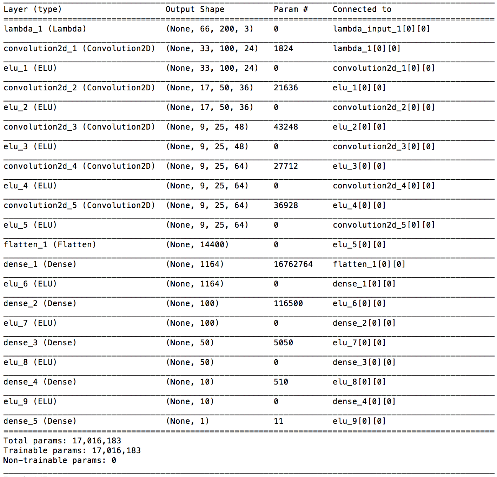
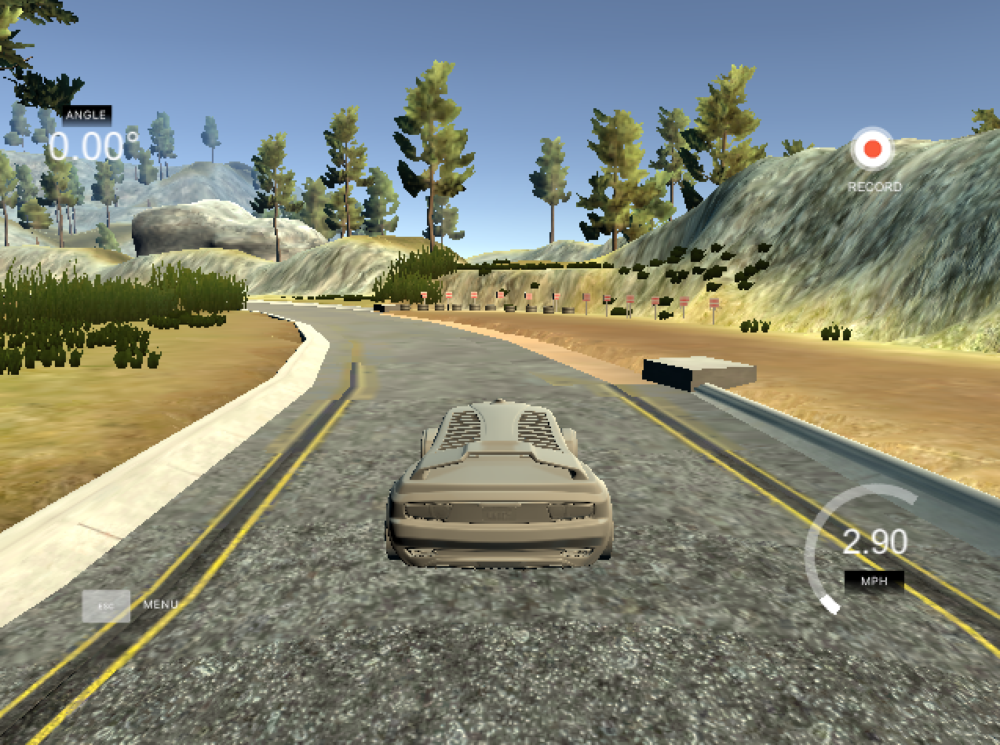
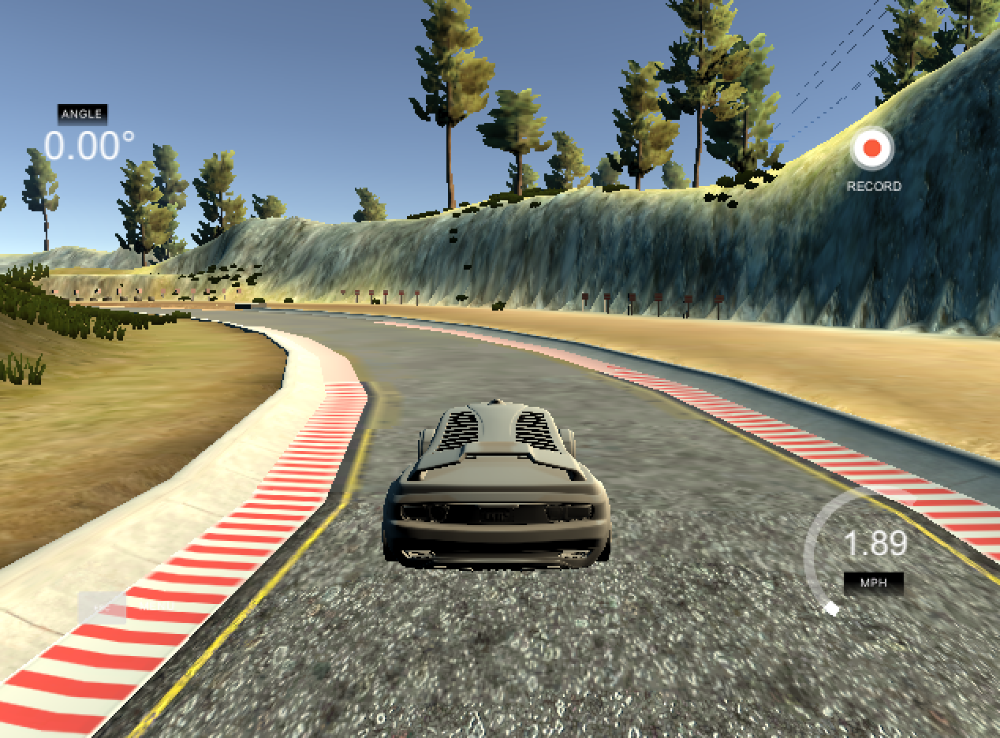
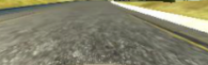
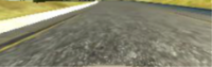

#**Behavioral Cloning** 


**Behavioral Cloning Project**

The goals / steps of this project are the following:


1. Use the simulator to collect data of good driving behavior
2. Build, a convolution neural network in Keras that predicts steering angles from images
3. Train and validate the model with a training and validation set
4. Test that the model successfully drives around track one without leaving the road
5. Summarize the results with a written report


[//]: # (Image References)

[image1]: ./examples/placeholder.png "Model Visualization"
[image2]: ./examples/placeholder.png "Grayscaling"
[image3]: ./examples/placeholder_small.png "Recovery Image"
[image4]: ./examples/placeholder_small.png "Recovery Image"
[image5]: ./examples/placeholder_small.png "Recovery Image"
[image6]: ./examples/placeholder_small.png "Normal Image"
[image7]: ./examples/placeholder_small.png "Flipped Image"


###Files Submitted & Code Quality

####1. Submission includes all required files and can be used to run the simulator in autonomous mode

My project includes the following files:


* model.py containing the script to create and train the model
* drive.py for driving the car in autonomous mode
* model.h5 containing a trained convolution neural network 
* writeup_behavior_cloning.md summarizing the results
* video.mp4 reflecting the captured video for the autonomous lap

####2. Submission includes functional code
Using the Udacity provided simulator and my drive.py file, the car can be driven autonomously around the track by executing 
```sh
python drive.py model.h5
```

####3. Submission code is usable and readable

The model.py file contains the code for training and saving the convolution neural network. The file shows the pipeline I used for training and validating the model, and it contains comments to explain how the code works.

###Model Architecture and Training Strategy

####1. An appropriate model architecture has been employed

My model consists of a convolution neural network based off of the NVIDIA model Architecture (reference [NVIDIA Model](https://devblogs.nvidia.com/parallelforall/deep-learning-self-driving-cars/)) with minor tweaks (model.py lines 100 - 121) 

The model includes ELU layers to introduce nonlinearity (code line 101 thru 121 after each layer), and the data is normalized in the model using a Keras lambda layer (code line 97). 

####2. Attempts to reduce overfitting in the model

The model contains dropout layers in order to reduce overfitting (model.py lines 111 and 113). 

The model was trained and validated on different data sets to ensure that the model was not overfitting (code line 128-130). The model was tested by running it through the simulator and ensuring that the vehicle could stay on the track.

####3. Model parameter tuning

The model used an adam optimizer, so the learning rate was not tuned manually (model.py line 123).

####4. Appropriate training data

Training data was chosen to keep the vehicle driving on the road. I used a combination of following-- 


1. center lane driving - nice and steady run through the center
2. recovering from the left and right sides of the road - to make sure there is some learning to be had from reaching closer to the side edges of the road
3. reverse loop to add more generalization - added a couple of loops to prevent overfitting

For details about how I created the training data, see the next section. 

###Model Architecture and Training Strategy

####1. Solution Design Approach

The overall strategy for deriving a model architecture was to start with a simple CNN model like LeNet and them move on to mode advanced/deeper architectures.

Some of the modes I tried with some sneak peak into the results - 

1. Simplistic CNN model with 2 Conv layers and 3 Dense layers - Car ran out of the tracks and rested on the sides 
2. LeNet - did not yield good results in terms of accuracy. Car was in the dumps and water a few times
3. Added a bunch of drop out and ELU layers - Only helped a little
4. Added more training data (as explained above) - helped improve the accuracy a little bit, but was still not there
5. VGG pertained weights - Poor accuracy, car was in the water s a few times :-)
6. VGG will fully trained model - little better but not there yet
7. NVIDIA model with bunch of ELU layers and drop out layers - this run gave me the best results at various speed (9, 15, 20, started wavering at very high speeds like 35 mph)

At the end of the process, the vehicle is able to drive autonomously around the track without leaving the road.

####2. Final Model Architecture

The final model architecture (model.py lines 18-24) consisted of a convolution neural network with the following layers and layer sizes ...

Here is a visualization of the architecture (note: visualizing the architecture is optional according to the project rubric)



####3. Creation of the Training Set & Training Process

I captured additional data set as explained above for the following use cases - 


1. center lane driving 
2. recovering from the left and right sides of the road 
3. reverse loop to add more generalization 

The sample images are as follows-- 






To augment the data sat, I also flipped images and adjusted the steering angles thinking that it would add more variety to the data to prevent overfitting. Some transformed images below.

Original



Flipped




I used this training data for training the model. The validation set helped determine if the model was over or under fitting. The ideal number of epochs was 7 as evidenced by trying various # of EPOCHS having different results. I used an adam optimizer so that manually training the learning rate wasn't necessary.
